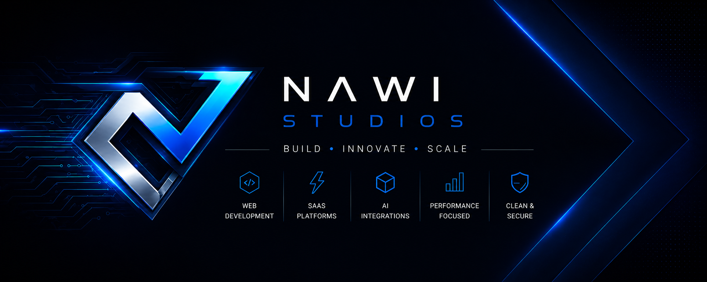

<h1 align="center">Hey, I'm Ayberk 👋</h1>

Full Stack Developer • AI Engineering Student • SaaS Builder

---

## Currently Building

### TableUp
Modern hospitality SaaS platform for restaurants, cafés and hospitality businesses.

### Nawi Studios
Premium digital studio building modern websites, SaaS platforms and AI-powered solutions.

---

## Tech Stack

---

## Focus Areas

- SaaS Development
- AI Integrations
- UI/UX Design
- Web Performance
- Modern Full-Stack Systems

---

## Links

- Website: https://nawistudios.com
- Website: https://tableup.app
- GitHub: https://github.com/thenawi

---

## Featured Projects

### TableUp
QR menu, table ordering and reservation platform for restaurants and cafés.

### Nawi Studios
Premium web experiences and scalable digital product development.

---

> Building modern digital experiences that combine performance, design and real-world functionality.

---

## GitHub Stats

  
  

